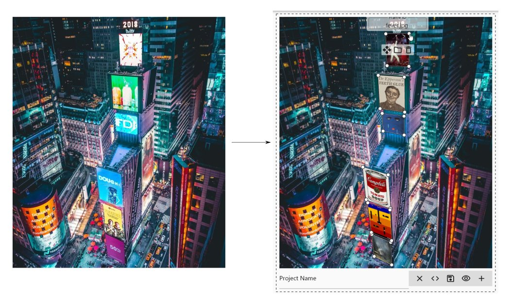

# Turning to face to the strange

On the web, CSS 3D transforms allow for the elements of a page to rotate and move towards and away from the user, but in my experience, punching numbers into API functions like `transform3D` to achieve the positioning you want is an awkward and trial-and-error-y process. Meanwhile, creating 3D graphics on desktop often ends up with learning a powerful program like Blender no matter how unambitious you are being with your visuals. I ran into this problem when I wanted to programmatically generate simple 2.5D graphics to represent New York Times Spelling Bee puzzles:


For that purpose, I created this simple app in Flutter that lets you graphically specify some quadrilaterals and then maps images onto them using simple but effective perspective transformations:



This app can export PNG images with the polished results of your projects, as well as JSON files that you can use in other programs or reopen later.

## Getting this thing to run

First, you need to install [Flutter](https://docs.flutter.dev/get-started/install). Then, you can download the code dependencies with `flutter pub get`. Finally, you can build for a desktop platform with e.g. `flutter build windows`. There is also a "demo version" that will open a pre-made project on launch that you can choose with the option `-t lib/main_demo.dart`.

### Web-Mode Caveats

For best visual quality, use the CanvasKit web renderer. Use this --dart-define flag to build for web due to a CanvasKit bug. Debug mode is not supported thereby 😔; only --profile and --release.

`--dart-define=BROWSER_IMAGE_DECODING_ENABLED=false`

Full command example:

`flutter build web --web-renderer canvaskit --dart-define=BROWSER_IMAGE_DECODING_ENABLED=false -t lib/main_demo.dart --release`

## Appendix A: Reading the JSON output in other programs

This program outputs several coordinate lists and matrices for each frame that you can read with other programs, if, for example, you want to keep the frame layout but switch out the images. The top-level structure has the following schema:

```
{
    "name": string,
    "frames": Frame[]
}
```

The Frame schema looks like this:

```
{
    "name": string,
    "4x4Matrix"?: Matrix,
    "3x3Matrix"?: Matrix,
    "4x4ReverseMatrix"?: Matrix,
    "3x3ReverseMatrix"?: Matrix,
    "4x4MatrixNormalized": Matrix,
    "3x3MatrixNormalized": Matrix,
    "4x4ReverseMatrixNormalized": Matrix,
    "3x3ReverseMatrixNormalized": Matrix,
    "worldPlanePoints": Coords[],
    "imagePlanePoints"?: Coords[],
    "name": string
}
```

Fields with a "?" after their name are only defined if the given frame has an image attached at the time that the JSON file is saved.

The Matrix schema consists of a list of lists of floats, making the elements accessible in row-major order. The Coords schema consists of a `[float, float]` tuple.

If you find the names of these fields incomprehensible, read on: you ain't seen nothing yet.

### Coordinate fields

Each coordinate field contains a list of four coordinates.

`worldPlanePoints` contains the coordinates of the points that define a frame, starting with the coordinate that was at the top left when the frame was created and proceeding clockwise from there. These coordinates are normalized, meaning that the x and y values are in the range [0, 1]. This is so that you can you can easily place them on an image of any size, without being restricted to the image dimensions that you originally created the project with; do so by multiplying each x-coordinate by the width of the background image you wish to use and each y-coordinate by the height.

`imagePlanePoints` describe the corresponding points (in the same order) in pixel coordinates from the image attached to the frame. Since these are the corners of the image, all the numbers are either 0 or one of the image's dimensions; this format is chosen because mapping the corners of the image to the corners of the frame is the heart of [the math behind all this](https://web.archive.org/web/20150222120106/xenia.media.mit.edu/~cwren/interpolator/).

### Matrix fields

The matrices output with each frame will help you take an input image and then transform it to fit within the frame accounting for a variety of scenarios. I am going to assume familiarity with the basic use of transformation matrixes, i.e. multiplying them by column vectors containing coordinates to get some transformed coordinates. Every field containing a matrix is prefixed with either 3x3 or 4x4. These can be used equivalently in 2D or 3D graphics settings, respectively; each 4x4 matrix lets the z coordinate pass through unaltered.

**The matrix fields `4x4Matrix` and `3x3Matrix`** define transformation matrices that will take any point in pixel coordinates on the image attached to the frame and translate it into normalized screen space coordinates. "Normalized screen space coordinates" means coordinates for the output such that the left edge of the output image is at x=0, the right edge is at x=1, the top edge is at y=0, and the bottom edge is at y=1. To take these matrices and make them deliver non-normalized pixel-based coordinates where the right and bottom edges correspond to your desired output width and height, respectively, left-multiply them by a scale matrix with the width as the x scale factor and the height as the y scale factor. It should look like this:

$\begin{bmatrix}\verb|your_output_width| & 0 & 0 \\ 0 & \verb|your_output_height| & 0 \\ 0 & 0 & 1\end{bmatrix} \times $ `3x3Matrix`

or

$\begin{bmatrix}\verb|your_output_width| & 0 & 0 & 0 \\ 0 & \verb|your_output_height| & 0 & 0 \\ 0 & 0 & 1 & 0 \\ 0 & 0 & 0 & 1\end{bmatrix} \times $ `4x4Matrix`

**The matrix fields `4x4ReverseMatrix` and `3x3ReverseMatrix`** reverse the above transformation; they will take any normalized screen space coordinates and deliver the corresponding pixel coordinates on the image that is attached to the frame when the file is saved. This is useful because, in order to make my life more difficult, the Python Imaging Library (PIL or Pillow)'s perspective transform function works in this direction and then doesn't document it anywhere. Presumably some other imaging toolkits out there also do this. FYI, if you are using a similar library that also takes "perspective transform coefficients" in its transform function instead of a matrix, give it the first 8 elements of the matrix in row-major order. The 9th element at the bottom right will always be 1, so it is redundant. But first: in order to use this matrix with a given non-normalized output size, do the multiplication from the last section but switch the order, naturally.

**The matrix fields `4x4MatrixNormalized` and `3x3MatrixNormalized`** are like `3x3Matrix`/`4x4Matrix` in that they map coordinates within the image to (normalized) coordinates within the output, but they ignore the dimensions of the image attached to the frame (and will be present in the output even if no such image is present) and assume that you're starting with _normalized_ coordinates within the image, where x and y are in the range [0, 1]. To get a version of one these matrices that allows for pixel coordinates for the input and output, left-multiply it by a scale matrix with `scaleX=outputWidth, scaleY=outputHeight` as above and then right-multiply the result with a `scaleX=1/inputImageWidth, scaleY=1/inputImageHeight` matrix. (Since matrix transformations effectively operate from right to left, you now have a matrix that takes pixel coordinates from within the input image that you are transforming, normalizes them so they'll work with the perspective transformation matrix, applies said matrix, and then de-normalizes them to get pixel coordinates that are somewhere within the output.)

**The matrix fields `4x4ReverseMatrixNormalized` and `3x3ReverseMatrixNormalized`** take normalized coordinates within the output's space and turn them into normalized coordinates within the input image's space. To use these with pixel coordinates, do the multiplication in the above section but reverse the order.

## Credits

The transformations used in this app were inspired by the perspective transform option in PIL, the Python Imaging Library. The underlying math is derived from [this archived page by Christopher R. Wren.](https://web.archive.org/web/20150222120106/xenia.media.mit.edu/~cwren/interpolator/).

The background image for the demo mode was taken by [Andre Benz](https://www.instagram.com/benz/?hl=en) and posted on [Unsplash](https://unsplash.com/photos/_T35CPjjSik).
