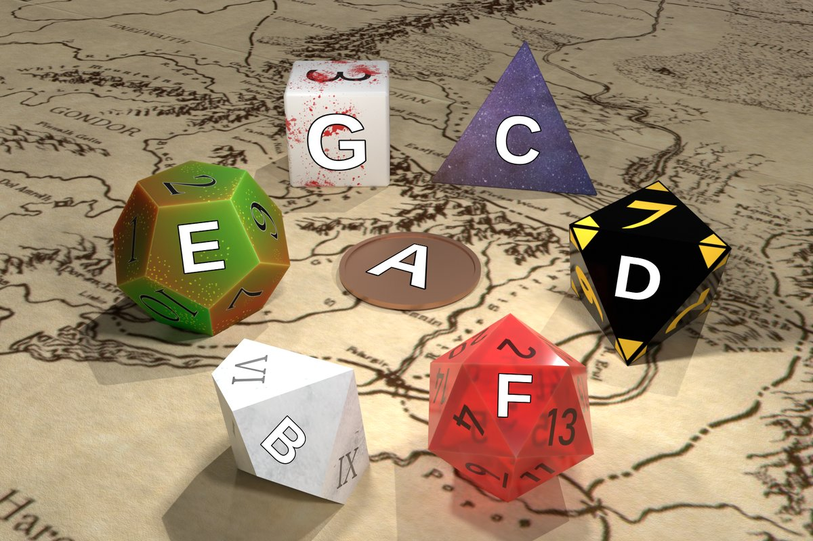

# Turning to face to the strange

On the web, CSS 3D transforms allow for the elements of a page to rotate and move towards and away from the user, but in my experience, punching numbers into API functions like `transform3D` to achieve the positionings you want is an awkward and trial-and-error-y process. Meanwhile, creating 3D graphics on desktop often ends up with learning a powerful program like Blender no matter how unambitious you are being with your visuals. I ran into this problem when I wanted to programmatically generate simple 2.5D graphics to represent New York Times Spelling Bee puzzles:

For that purpose, I created this simple app in Flutter that lets you graphically specify some quadrilaterals and then maps images onto them using simple but effective perspective transfomations:

This app can export PNG images with the polished results of your projects as well as JSON files that describe it in detail.

## Getting this thing to run

First, you need to install [Flutter](https://docs.flutter.dev/get-started/install). Then, you can download the code dependencies with `flutter pub get`. Finally, you can build for a desktop platform with e.g. `flutter build windows`. There is also a "demo version" that will open a pre-made project on launch that you can choose with the option `-t lib/main_demo.dart`.

### Web-Mode Caveats

For best visual quality, use the CanvasKit web renderer. Use this --dart-define flag to build for web due to a CanvasKit bug. Debug mode is not supported thereby 😔; only --profile and --release.

`--dart-define=BROWSER_IMAGE_DECODING_ENABLED=false`

Full command example:

`flutter build web --web-renderer canvaskit --dart-define=BROWSER_IMAGE_DECODING_ENABLED=false -t lib/main_demo.dart --release`

## Appendix: Reading the JSON output

## Credits

The transfomations used in this app were inspired by the perspective transform option in PIL, the Python Imaging Library. The underlying math was best explained [here](https://web.archive.org/web/20150222120106/xenia.media.mit.edu/~cwren/interpolator/).

The background image for the demo mode was taken by [Andre Benz](https://www.instagram.com/benz/?hl=en) and posted on [Unsplash](https://unsplash.com/photos/_T35CPjjSik).
